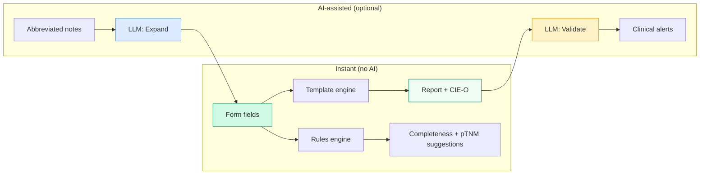

# Pathology Report Assistant

[](https://react.dev/)
[](https://www.python.org/)
[](LICENSE)
[](#protocols)

An **AI-assisted pathology reporting copilot** that helps pathologists generate structured reports following [CAP](https://www.cap.org/protocols-and-guidelines) / [ICCR](https://www.iccr-cancer.org/) protocols — with real-time completeness tracking, clinical validation, and ICD-O coding.

> **Not a medical device.** For demonstration and portfolio purposes only. All data is synthetic. See [DISCLAIMER.md](DISCLAIMER.md).

---

## Two Modes

### Copilot — Build reports while you work

The pathologist fills a protocol-specific form (or types abbreviated notes) and the report generates **instantly** via templates. AI assists optionally:

- **Real-time dictionary parser**: type `adeno mod G2 2/18 gang` → form fields auto-populate
- **Protocol-aware form**: dropdowns, tri-state controls (Present/Absent/NE), severity labels
- **Instant report generation**: 3 styles (prose narrative, synoptic checklist, mixed)
- **pTNM auto-suggestions**: based on filled fields, with AJCC 8th Ed. reference popup
- **CIE-O/ICD-O coding**: auto-generated from selected histology and location
- **AI review** (optional): detects clinical inconsistencies only a domain expert would notice

### Auditor — Review existing reports

Paste a signed pathology report. The AI analyzes it against CAP/ICCR protocols:

- **Completeness score**: % of required fields present
- **Missing fields**: listed with severity (Critical/Major/Minor) and action items
- **Clinical inconsistencies**: cross-field errors (e.g., pT3 without lymph node count)
- **Suggested CIE-O coding**: topography + morphology codes

---

## Architecture



The core experience (form → report) is **instant** — no AI needed. AI is used only for:
1. **Pre-fill from notes**: interpret abbreviated text and populate form fields (~5s with Gemini Flash)
2. **Clinical review**: detect inconsistencies that rules can't catch (~5s)

---

## Protocols

Protocol-specific forms with field definitions, severity levels, and validation rules:

| Protocol | Organ | Fields | Key Features |
|----------|-------|--------|-------------|
| Colon/Rectum resection | Colon | 19 | pTNM staging, ≥12 lymph nodes, MMR/MSI |
| Cutaneous melanoma | Skin | 14 | Breslow + ulceration → pT, Clark level, neurotropism |
| Breast biopsy/resection | Breast | 12 | ER/PR/HER2/Ki-67, Nottingham grade |
| Gastric carcinoma | Stomach | 17 | Lauren type, ≥16 lymph nodes, HER2 |
| Cervical cytology | Cervix | 8 | Bethesda classification |

Each protocol includes:
- Bilingual labels (ES/EN)
- CIE-O/ICD-O topography and morphology codes
- pT/pN/pM dropdowns with AJCC 8th Edition descriptions
- Abbreviation dictionary for real-time text parsing

---

## Quick Start

### Frontend (React)

```bash
cd frontend
npm install
npm run dev
# Opens at http://localhost:5173
```

The form + templates + parser work **without any API key**. Only the "Pre-fill with AI" and "Review with AI" buttons need an LLM provider.

### Backend (Python CLI)

```bash
pip install -r requirements.txt
cp .env.example .env
# Edit .env with your OpenRouter API key

python -m src.agent sample-reports/colon-adenocarcinoma-complete.txt --provider openrouter
```

### Cloudflare Worker (API proxy)

```bash
cd demo
npm install
npx wrangler dev  # Local dev at http://localhost:8787
```

### Tests

```bash
pytest tests/ -v
```

---

## Tech Stack

| Layer | Technology |
|-------|-----------|
| Frontend | React 19, Vite, Tailwind CSS v4, Framer Motion |
| Backend | Python, Pydantic v2, httpx |
| LLM | Google Gemini 2.5 Flash (via OpenRouter) or Ollama (local) |
| API proxy | Cloudflare Worker (API key isolation) |
| Protocols | YAML (machine-readable, versionable) |

---

## Key Features

- **Bilingual** (ES/EN) — all labels, prompts, and reports
- **Dark mode** + font size adjustment
- **Responsive** — desktop, tablet, mobile
- **Access code** — server-side validation, rate limiting
- **Editable dictionary** — pathologists add their own abbreviations
- **Report format config** — section headers in UPPERCASE/Bold/Normal
- **Human-in-the-loop** — AI assists, never decides

---

## Regulatory Positioning

Designed as a **preparatory task** tool under EU AI Act Art. 6(3)(d) — structures information for review by a qualified healthcare professional. Does not autonomously make clinical decisions.

See [DISCLAIMER.md](DISCLAIMER.md) and [docs/regulatory.md](docs/regulatory.md).

---

## References

1. Grothey, A. et al. (2025). Automated structuring of cancer pathology reports using LLMs. *Communications Medicine*, 5(1), 48.
2. Gorenshtein, D. et al. (2025). Agentic AI in medicine: systematic review. *medRxiv*.
3. Strata, S. et al. (2025). Open-source LLM for pathology data extraction. *Scientific Reports*, 15, 2927.
4. College of American Pathologists. Cancer protocol templates. [cap.org](https://www.cap.org/protocols-and-guidelines)
5. International Collaboration on Cancer Reporting. Datasets. [iccr-cancer.org](https://www.iccr-cancer.org/)

---

## License

[MIT](LICENSE) — (c) 2026 solfloreslab
