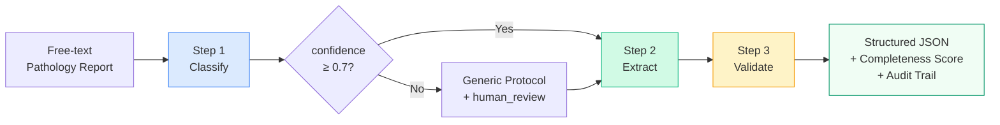

# Pathology Report Structuring Agent

[](https://www.python.org/)
[](LICENSE)
[](https://docs.pydantic.dev/)
[](#protocols)

An **agentic AI pipeline** that transforms free-text pathology reports into structured data following [CAP](https://www.cap.org/protocols-and-guidelines) / [ICCR](https://www.iccr-cancer.org/) protocols — with automated completeness validation and quality control.

> **Not a medical device.** For demonstration and portfolio purposes only. All data is synthetic. See [DISCLAIMER.md](DISCLAIMER.md).

---

## Why This Exists

Narrative pathology reports achieve only **77% completeness** of required fields, compared to **98% with synoptic formats** (SEAP guidelines). Meanwhile, Grothey et al. (2025) demonstrated that LLMs extract structured data from pathology reports with **97–98% accuracy** across 579 reports.

This agent bridges that gap: it reads a free-text report, classifies the specimen, extracts structured fields per protocol, and validates completeness — flagging missing critical data before it reaches the clinician.

No hospital in Spain had deployed genuinely agentic AI for pathology report structuring as of March 2026.

---

## Architecture



Each step is a **separate LLM call** with a specialized system prompt and protocol-specific context:

| Step | Role | Input | Output |
|------|------|-------|--------|
| **Classify** | Identify specimen type, organ, protocol | Raw report text | `ClassificationResult` (protocol ID + confidence) |
| **Extract** | Pull structured fields per protocol | Report + protocol field definitions | Key-value pairs per CAP/ICCR fields |
| **Validate** | Check completeness and consistency | Extracted data + protocol rules | `ValidationResult` (score, missing fields, inconsistencies) |

This follows the **single-agent with tool-calling** pattern recommended by the Mount Sinai systematic review (Gorenshtein et al., 2025), which found agentic systems outperform base LLMs by a median of +53 percentage points.

---

## Protocols

Five tumor-specific protocols defined as **machine-readable YAML** in [`protocols/`](protocols/):

| Protocol | Organ | Fields | Rules |
|----------|-------|--------|-------|
| `colon-resection` | Colon/Rectum | 19 | pTNM staging, lymph node minimum (≥12), MMR/MSI |
| `breast-biopsy` | Breast | 12 | ER/PR/HER2/Ki-67 mandatory, FISH for HER2 2+ |
| `melanoma` | Skin | 14 | Breslow mandatory, ulceration if >1mm, sentinel LN if ≥pT2b |
| `gastric` | Stomach | 17 | Lymph node minimum (≥16), HER2 for advanced, diffuse→G3 |
| `cytology-cervical` | Cervix | 8 | Bethesda mandatory, colposcopy for ASC-H+ |

Each YAML defines `fields` (name, severity, type, allowed values) and `rules` (conditional checks with severity levels).

---

## Results

Tested against 5 synthetic reports (all in [`sample-reports/`](sample-reports/)):

| Report | Confidence | Fields | Completeness | Status |
|--------|-----------|--------|-------------|--------|
| Colon adenocarcinoma (complete) | 0.98 | 19 | 100% | `complete` |
| Breast ductal carcinoma (BAG) | 0.98 | 12 | 95% | `complete` |
| Cutaneous melanoma | 0.95 | 14 | 97% | `complete` |
| Cervical cytology HSIL | 1.00 | 8 | 80% | `mostly_complete` |
| Gastric carcinoma (incomplete) | 0.95 | 17 | 38% | `critically_incomplete` |

The gastric case is **designed to fail** — the report omits pTNM staging, lymph node count, HER2 status, histologic grade, and invasion details. The agent correctly flags 5 critical/major missing fields and 3 clinical inconsistencies.

Full JSON outputs are in [`output-examples/`](output-examples/).

---

## Quick Start

### Requirements

- Python 3.10+
- An [OpenRouter](https://openrouter.ai/) API key or a local [Ollama](https://ollama.com/) instance

### Installation

```bash
git clone https://github.com/solfloreslab/pathology-report-agent.git
cd pathology-report-agent
pip install -r requirements.txt
```

### Configuration

```bash
cp .env.example .env
# Edit .env with your API key
```

### Run

```bash
# Using OpenRouter (default: GLM-5)
python -m src.agent sample-reports/colon-adenocarcinoma-complete.txt --provider openrouter

# Using local Ollama
python -m src.agent sample-reports/gastric-incomplete.txt --provider ollama --model qwen3:14b

# Save output to file
python -m src.agent sample-reports/breast-ductal-carcinoma.txt --output results.json --verbose
```

### Tests

```bash
pytest tests/ -v
```

---

## Project Structure

```
pathology-report-agent/
├── src/
│   ├── agent.py            # Pipeline orchestrator + CLI
│   ├── schemas.py          # Pydantic v2 models
│   ├── llm_client.py       # OpenRouter/Ollama abstraction (retry + JSON repair)
│   ├── protocols.py        # YAML protocol registry
│   └── prompts/            # System prompts (classifier, 5 extractors, validator)
├── protocols/              # 5 YAML protocol definitions
├── sample-reports/         # 5 synthetic pathology reports (Spanish)
├── output-examples/        # Generated JSON results
├── demo/
│   ├── index.html          # Frontend SPA
│   ├── worker.js           # Cloudflare Worker (API proxy)
│   └── wrangler.toml       # Worker deployment config
├── tests/                  # pytest suite (schemas, classifier, validator, pipeline)
├── docs/                   # Architecture, regulatory, references
├── DISCLAIMER.md           # Regulatory disclaimer
├── LICENSE                 # MIT
└── requirements.txt
```

---

## Design Decisions

| Decision | Rationale |
|----------|-----------|
| **Pydantic v2** (not dataclasses) | Runtime validation + JSON Schema generation for prompt injection |
| **YAML protocols** (not free-form markdown) | Machine-readable, versionable, auditable field definitions |
| **Synchronous httpx** with retry + exponential backoff | Simplicity for MVP; async deferred to v2 |
| **JSON repair** in LLM client | Handles markdown fences, trailing commas, partial JSON from any model |
| **Confidence gate at 0.7** | Prevents misclassification from cascading — falls back to generic + human review |
| **Temperature 0.1** | Minimizes hallucination in structured extraction |
| **Cloudflare Worker** for demo | API key isolation — key never reaches the browser |

---

## Regulatory Positioning

This project is designed as a **preparatory task** tool under EU AI Act Art. 6(3)(d) — it structures information for subsequent review by a qualified healthcare professional. It does not autonomously make clinical decisions.

Key regulatory considerations:
- **EU AI Act**: Preparatory task exemption (Art. 6(3)(d))
- **Not a medical device**: Structures data without influencing clinical decisions (MDCG 2019-11)
- **GDPR Art. 9(2)(h)**: Health data processing under healthcare professional responsibility
- **Audit trail**: Full traceability per Art. 12 (timestamps, model version, confidence scores)
- **Human-in-the-loop**: Art. 14 compliance — clinician override at every step

See [DISCLAIMER.md](DISCLAIMER.md) for the full regulatory disclaimer.

---

## Scientific References

1. Grothey, A. et al. (2025). Automated structuring of cancer pathology reports using LLMs. *Communications Medicine*, 5(1), 48.
2. Gorenshtein, D. et al. (2025). Agentic AI in medicine: systematic review. *medRxiv*.
3. Strata, S. et al. (2025). Open-source LLM for pathology data extraction. *Scientific Reports*, 15, 2927.
4. Chen, S. et al. (2024). BB-TEN: TNM extraction from pathology reports. *Nature Communications*, 15, 9684.
5. Hu, B. et al. (2025). LLM agents for biomedical text structuring. *Frontiers in Medicine*, 12, 1530565.
6. College of American Pathologists. Cancer protocol templates. [cap.org](https://www.cap.org/protocols-and-guidelines)
7. International Collaboration on Cancer Reporting. Datasets. [iccr-cancer.org](https://www.iccr-cancer.org/)

---

## License

[MIT](LICENSE) — (c) 2026 solfloreslab
