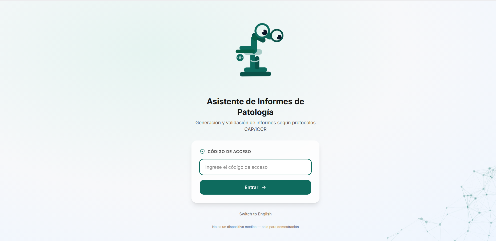
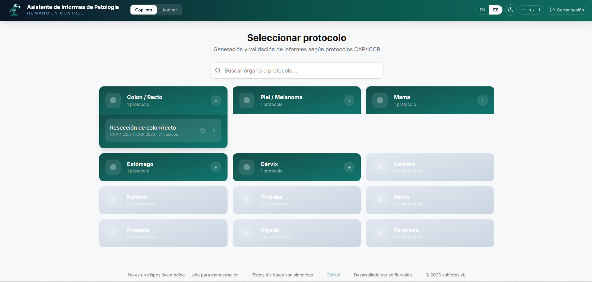
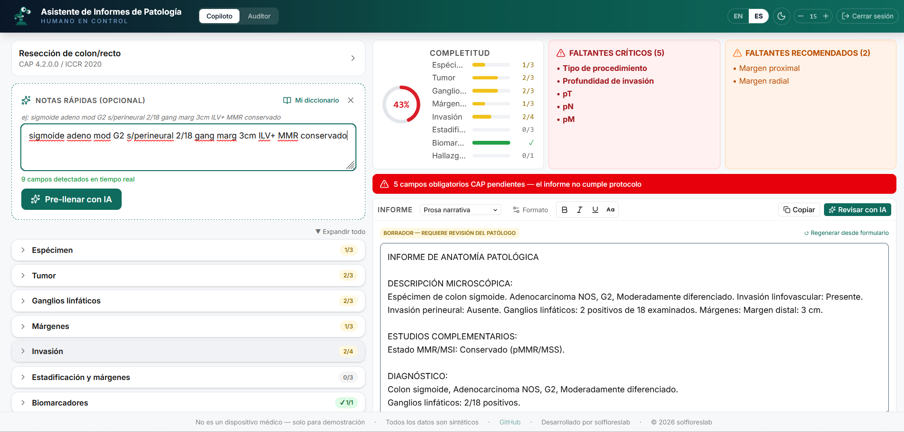
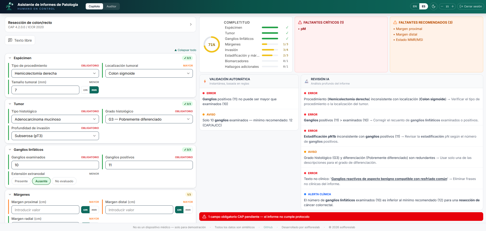
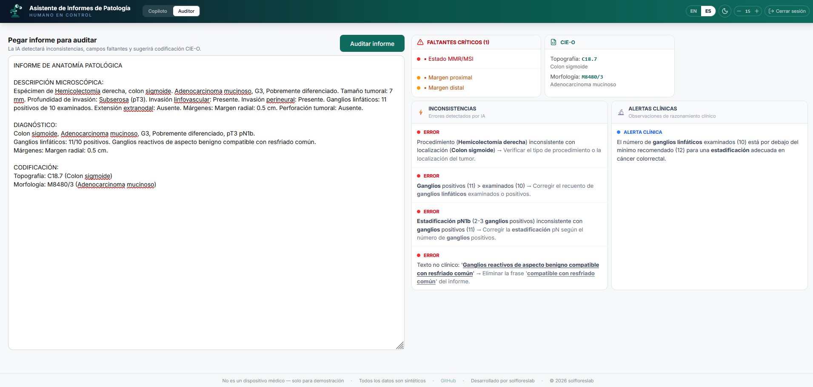
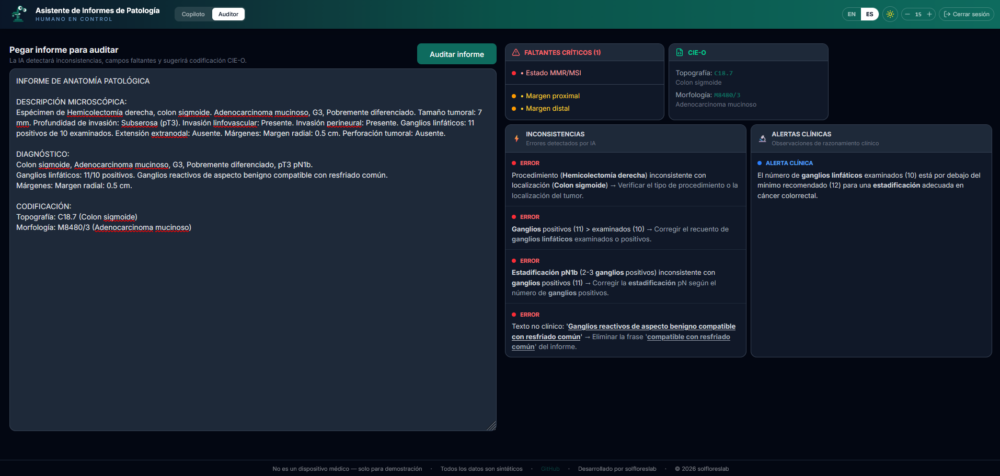
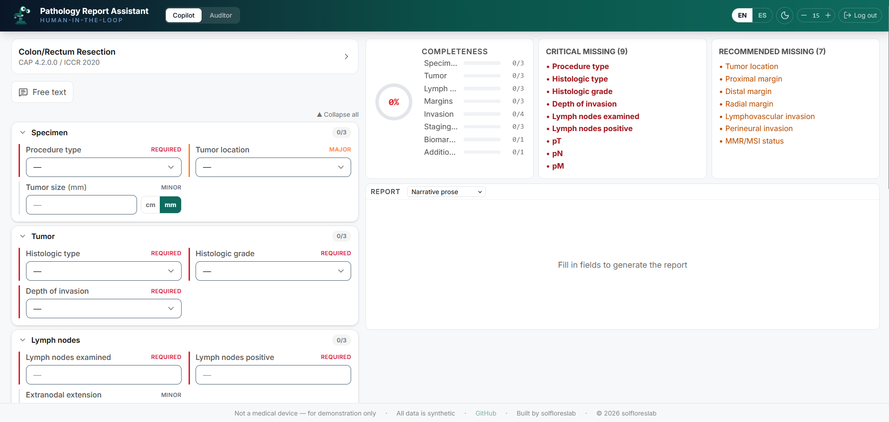

# Pathology Report Assistant

[](https://react.dev/)
[](https://www.python.org/)
[](LICENSE)
[](#protocols)
[](#project-status)
[](https://pathology-report-assistant.pages.dev)

A pathology report assistant with structured forms following CAP/ICCR protocols, real-time clinical validation, and optional AI review.

> **Not a medical device.** For demonstration and portfolio purposes only. All data is synthetic. See [DISCLAIMER.md](DISCLAIMER.md).

> **🚧 Active Development** — This project is updated frequently. Features described below are at different levels of maturity.

### Screenshots

| Login | Protocol selection |
|:---:|:---:|
|  |  |

| Copilot: text to report | Copilot: AI review with error detection |
|:---:|:---:|
|  |  |

| Auditor mode | Dark mode |
|:---:|:---:|
|  |  |

| English interface |
|:---:|
|  |

---

## What it does

The pathologist selects a protocol (e.g., colon resection), fills a form with case data, and the system automatically generates a structured report with completeness tracking, ICD-O coding, and pTNM staging suggestions.

The core experience (form → report) is **instant** — no AI or internet required. AI assists optionally for interpreting abbreviated notes or reviewing completed reports.

### Copilot Mode — Generate reports while you work

- **Protocol-specific form**: CAP dropdowns, tri-state controls (Present/Absent/Not evaluated), numeric validation
- **Instant report generation**: 3 styles (narrative prose, synoptic checklist, mixed)
- **Free-text parser**: type `adeno mod G2 2/18 gang` → form fields auto-populate in real-time
- **pTNM auto-suggestions**: based on filled fields (depth of invasion, tumor size → pT; lymph node count → pN) with AJCC 8th Ed. reference
- **ICD-O coding**: auto-generated from selected histology and location
- **Deterministic inline rules**: instant alerts without AI (e.g., "positive nodes > examined", "pT3 without lymph node evaluation", "anatomical mismatch: right hemicolectomy + sigmoid")
- **CAP compliance banner**: warning when required protocol fields are missing
- **AI pre-fill** (optional): send abbreviated notes to LLM that populates form (~5s with Gemini Flash)
- **AI review** (optional): detect clinical inconsistencies that rules can't catch (~5s)

### Auditor Mode — Review existing reports

Paste the clinical text of a report (microscopic description, diagnosis — no patient data). The AI analyzes it against CAP/ICCR protocols:

- Completeness score (% of required fields present)
- Missing fields with severity (Critical/Major/Minor) and suggested actions
- Clinical inconsistencies (ERROR for impossible, WARNING for unusual)
- Clinical alerts (reasoning observations)
- Suggested ICD-O coding (topography + morphology)

---

## Protocols

| Protocol | Organ | Status | Inline rules | TNM suggestions | ICD-O |
|----------|-------|--------|--------------|-----------------|-------|
| Colon/rectum resection | Colon | **Verified** ✅ | ✅ | ✅ pT + pN | ✅ |
| Cutaneous melanoma | Skin | Available | ✅ | ✅ pT (Breslow) | ✅ |
| Breast biopsy/resection | Breast | Available | ✅ | ✅ pT + pN | ✅ |
| Gastric carcinoma | Stomach | Available | ✅ | ✅ pT + pN | ✅ |
| Cervical carcinoma | Cervix | Available | ✅ | ✅ pT | ✅ |

Each protocol includes bilingual labels (ES/EN), ICD-O codes, AJCC 8th Ed. pT/pN/pM dropdowns with descriptions, and an abbreviation dictionary for the real-time parser.

> **Note**: Colon/rectum resection has been thoroughly tested. Other protocols are available and functional but have not yet been formally verified.

---

## Quick Start

### Frontend (form + reports — works without API key)

```bash
cd frontend
npm install
npm run dev
# Opens at http://localhost:5173
```

The form, templates, parser, validation rules, and TNM suggestions work **without any AI or API key**.

### For AI features (Pre-fill + Review)

```bash
cd demo
npm install

# Create .dev.vars with your keys:
echo "OPENROUTER_API_KEY=sk-or-v1-your-key" > .dev.vars
echo "ACCESS_CODE=your-access-code" >> .dev.vars

npx wrangler dev  # http://localhost:8787
```

### Python backend (original pipeline — advanced use)

```bash
pip install -r requirements.txt
cp .env.example .env
# Edit .env with your API key

python -m src.agent sample-reports/colon-adenocarcinoma-complete.txt --provider openrouter
```

### Tests

```bash
pytest tests/ -v  # 11 tests
```

---

## Architecture

```
┌──────────────────────────────────────────────────────┐
│  INSTANT LAYER (no AI, no internet)                  │
│                                                      │
│  Form fields → Template engine → Report + ICD-O      │
│  Form fields → Rules engine → Alerts + pTNM          │
│  Free text   → Dictionary parser → Form fields       │
└──────────────────────────────────────────────────────┘
                        │
                        ▼ (optional)
┌──────────────────────────────────────────────────────┐
│  AI LAYER (requires API key or Ollama local)         │
│                                                      │
│  Abbreviated notes → LLM → Form fields               │
│  Complete report   → LLM → Clinical inconsistencies  │
└──────────────────────────────────────────────────────┘
```

The separation is intentional: 80% of functionality is deterministic and instant. AI is used only where it adds value that rules cannot provide (clinical reasoning, free text interpretation).

---

## Tech Stack

| Layer | Technology |
|-------|-----------|
| Frontend | React 19, Vite, Tailwind CSS v4, Framer Motion |
| Backend | Python 3.10+, Pydantic v2, httpx |
| LLM | Google Gemini 2.5 Flash (via OpenRouter) or Ollama (local) |
| API proxy | Cloudflare Worker (API key isolation, rate limiting) |
| Protocols | YAML (machine-readable, versionable) |

---

## Design Principles

- **Human in control**: the tool suggests, the pathologist decides. Never auto-fills without confirmation.
- **Form first**: the primary mode is the structured form (industry standard). Free text is a complementary alternative.
- **AI where it adds value, rules where they suffice**: deterministic validations for obvious checks, AI for clinical reasoning.
- **Privacy**: compatible with Ollama local (data never leaves the hospital). No real patient data.
- **LIS independent**: works as a standalone web tool. The pathologist copies the result to their system.

---

## Project Status

### Working now
- Form-first copilot with 5 oncology protocols
- Instant report generation (3 styles)
- Inline validation rules (no AI, instant)
- Automatic pTNM suggestions with AJCC reference
- Automatic ICD-O coding
- Free-text parser to form fields
- Auditor mode with AI (Gemini Flash, ~5s)
- Bilingual ES/EN, dark mode, zoom
- Customizable abbreviation dictionary
- Anatomy mismatch detection (procedure vs location)

### In development
- 12 additional protocols (prostate, lung, thyroid, kidney, bladder, pancreas, liver, endometrium, and more)
- Formal accuracy evaluation
- Visual design improvements
- Cloudflare deployment (Worker + Pages)

### Future roadmap
- FHIR/HL7 integration
- Free text → synoptic mode for non-oncology cases
- Retrospective report import
- Voice input support

---

## Access

The application uses a simple access code (not patient authentication). For the demo:

- The access code protects the AI API budget, not patient data (there is no patient data)
- The OpenRouter API key is stored as a Worker secret and is never exposed to the browser

---

## Regulatory Positioning

Designed as a **preparatory task** tool under EU AI Act Art. 6(3)(d) — structures information for review by a qualified healthcare professional. Does not autonomously make clinical decisions.

See [DISCLAIMER.md](DISCLAIMER.md) and [docs/regulatory.md](docs/regulatory.md).

---

## References

1. Rajaganapathy, S. et al. (2025). Automated synoptic reporting from narrative pathology reports using LLMs. *npj Health Systems*, Mayo Clinic.
2. Grothey, A. et al. (2025). Automated structuring of cancer pathology reports. *Communications Medicine*, 5(1), 48.
3. Strata, S. et al. (2025). Open-source LLM for pathology data extraction. *Scientific Reports*, 15, 2927.
4. College of American Pathologists. Cancer protocol templates. [cap.org](https://www.cap.org/protocols-and-guidelines)
5. International Collaboration on Cancer Reporting. [iccr-cancer.org](https://www.iccr-cancer.org/)

---

## License

[MIT](LICENSE) — © 2026 solfloreslab
